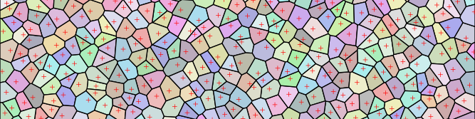

# forvor

Fortune's Voronoi generator

## Introduction

This is a copy of the Public Domain [Voronoi](http://en.wikipedia.org/wiki/Voronoi_diagram) code by [Steven Fortune](http://ect.bell-labs.com/who/sjf/).
The algorithm is known as [Fortune's algorithm](http://en.wikipedia.org/wiki/Fortune%27s_algorithm).

This repository started as a direct copy of the original C source code.
It containst the following improvements:
* Fixes for the memory leaks.
* SVG generator tool that can take the algorithm's output and generate an SVG file depicting the Voronoi regions.

And in time will contain the following improvements:
* Clipping the regions agaist a rectangle.
* Output of polygon data, instead of just edges only.

## License

The original source code by Fortune is in the Public Domain.
So this version will also be in the public domain.

## Authors

Original source code by [Steven Fortune](http://ect.bell-labs.com/who/sjf/).
Enhancements by [Bram Stolk](http://stolk.org).

